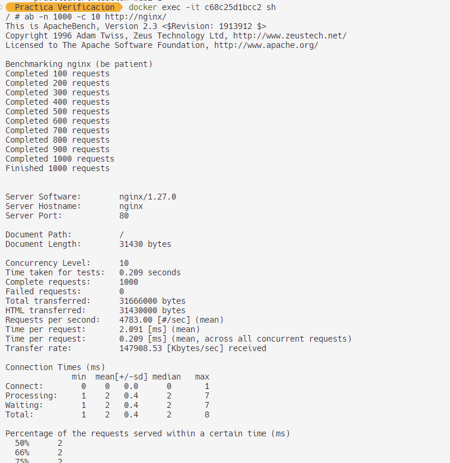

# Práctica de Verificación de Rendimiento

Este proyecto configura un entorno de pruebas de rendimiento utilizando Docker Compose con Nginx como balanceador de carga y Apache Bench (`ab`) para realizar las pruebas de carga. El entorno está compuesto por dos servicios web y un servicio de balanceo de carga Nginx. Apache Bench se utiliza para medir el rendimiento del balanceador de carga.

## Estructura del Proyecto

La estructura del proyecto es la siguiente:

performance-test/
│
├── docker-compose.yml
├── nginx/
│ ├── Dockerfile
│ ├── nginx.conf
├── web/
│ ├── Dockerfile
│ └── index.html
└── ab/
└── Dockerfile


### Archivos

- **`docker-compose.yml`**: Archivo de configuración para Docker Compose.
- **`nginx/`**: Directorio con el Dockerfile y configuración de Nginx.
- **`web/`**: Directorio con el Dockerfile y contenido estático de las páginas web.
- **`ab/`**: Directorio con el Dockerfile para instalar Apache Bench.

## Requisitos

- Docker
- Docker Compose

## Instalación y Ejecución

1. **Clona el repositorio:**

    ```bash
    git clone <url_del_repositorio>
    cd performance-test
    ```

2. **Construye y levanta los contenedores:**

    ```bash
    docker-compose up --build -d
    ```

    Esto construirá las imágenes de los contenedores y los levantará en segundo plano.

3. **Verifica que los contenedores están corriendo:**

    ```bash
    docker ps
    ```

    Deberías ver algo como esto:

    ```plaintext
    CONTAINER ID   IMAGE                      COMMAND                  CREATED          STATUS          PORTS                               NAMES
    123456789abc   performance-test_ab        "sh -c 'while true; …"   10 minutes ago   Up 10 minutes                                       performance-test_ab_1
    23456789bcde   performance-test_nginx      "/docker-entrypoint.…"  10 minutes ago   Up 10 minutes   0.0.0.0:80->80/tcp                performance-test_nginx_1
    3456789cdefg   performance-test_web        "/docker-entrypoint.…"  10 minutes ago   Up 10 minutes                                       performance-test_web_1
    456789defgh   performance-test_web        "/docker-entrypoint.…"  10 minutes ago   Up 10 minutes                                       performance-test_web_2
    ```

4. **Accede al contenedor `ab` para ejecutar Apache Bench:**

    ```bash
    docker exec -it performance-test_ab_1 sh
    ```

5. **Ejecuta las pruebas de rendimiento:**

    ```bash
    ab -n 1000 -c 10 http://nginx/
    ```

    Esto enviará 1000 solicitudes al balanceador de carga Nginx con una concurrencia de 10 solicitudes simultáneas.

## Descripción de Archivos

- **`docker-compose.yml`**: Configura los servicios `web1`, `web2`, `nginx` y `ab`. Conecta todos los servicios en una red llamada `webnet`.
- **`nginx/nginx.conf`**: Configuración de Nginx para balanceo de carga entre los servicios `web1` y `web2`.
- **`nginx/Dockerfile`**: Dockerfile para construir la imagen de Nginx con la configuración personalizada.
- **`web/Dockerfile`**: Dockerfile para construir la imagen de los servidores web que sirven contenido estático.
- **`ab/Dockerfile`**: Dockerfile para construir la imagen con Apache Bench instalado.

## Resultados

Después de ejecutar el comando `ab`, revisa la salida en la terminal del contenedor `ab` para obtener detalles sobre el rendimiento, como el número de solicitudes procesadas por segundo, tiempos de respuesta y otros indicadores clave.

## Limpieza

Para detener y eliminar los contenedores y redes creados, ejecuta:

```bash
docker-compose down

# Imagen de prueba
